  

  
  
  

---

### 👨‍💻 About Me

Hi! I'm **Muhamad Sayib Roziq, S.Kom** (Ozzy), a **Backend & Distributed Systems Engineer** based in Jakarta, Indonesia 🇮🇩.

With **5+ years of software engineering** and **4+ years of professional backend experience**, I specialize in architecting high-throughput enterprise ERP ecosystems, real-time data monitoring platforms, and scalable serverless backends on **Google Cloud Platform (GCP)** and **AWS**. I place strong emphasis on **Clean Architecture**, **SOLID principles**, modular monoliths, and seamless microservice decomposition.

Beyond enterprise backend systems, I actively research and build **Agentic AI systems** (workflows, skills for AI coding agents, and cost-optimized RAG pipelines) and systems tooling in **Go** and **Luau**.

> *"Code is read much more often than it is written. Design for clarity, testability, and resilience."*

---

### 🛠 Tech Stack

| Category | Technologies & Tools |
| :--- | :--- |
| **Languages** |  |
| **Backend & Frameworks** |  |
| **Databases & Cache** |  |
| **Cloud & DevOps** |  |
| **Productivity & IDEs** |  |

---

### 🏗 Architecture & Engineering Focus

* **Distributed Systems & Monolith Modularization:** Applying Domain-Driven Design (DDD), Repository Design Patterns, and gRPC to decouple complex legacy systems into isolated, testable modules.
* **Cloud Architecture & FinOps (GCP & AWS):** Designing serverless, event-driven platforms (Cloud Run, Cloud SQL, BigQuery, EC2) maintaining low latency across nationwide branches while optimizing cost-to-performance.
* **Proactive Security & Governance:** Defense-in-depth with HTTP response header hardening (CSP, HSTS), secret scanning governance, and rapid incident triage.
* **Agentic AI & Engineering Automation:** Developing structured agentic skills for AI coding agents (Claude Code, Google Antigravity, OpenAI Codex), zero-cost RAG pipelines, and local LLM evaluation.

---

### 🚀 Highlight Projects

* 🏢 **Enterprise ERP & Multi-Tenant Business Ecosystem** *(Enterprise / Cloud)*  
  Architected an integrated enterprise ERP platform (Inventory & Warehouse, Asset Management, Finance & Accounting, Operations) sustaining nationwide business units on **Google Cloud Platform (Cloud Run, Cloud SQL, BigQuery)** with Clean Architecture & automated CI/CD.

* 🤖 **[Roblox-Dev-Skill](https://github.com/MSayib/roblox-dev-suite)** *(Open Source / Agentic AI)*  
  Standardized agentic skill suite for AI coding assistants (Claude Code, Google Antigravity, OpenAI Codex) covering Luau architecture, MicroProfiler performance analysis, and Roblox Studio MCP protocols.

* 🧠 **Zero-Cost RAG AI Pipeline** *(Case Study / AI Engineering)*  
  Designed an automated knowledge-retrieval pipeline using Langflow, web extractors, vector search (pgvector & AstraDB), and LiteLLM model proxies with zero operational hosting overhead.

---

### 📊 GitHub Activity & Stats

  

 

  
  

---

### ⚡ Fun Facts & Connect

- 🔭 **Current Quest:** Agentic AI coding workflows & Studio MCP tooling, Go systems engineering, and high-throughput enterprise backends.
- 🎓 **Education:** Bachelor of Computer Science (S.Kom) in Informatics.
- ☕ **Fuel:** A good coffee.
- 🎮 **Downtime:** Roblox & Reading.

   
  
  

